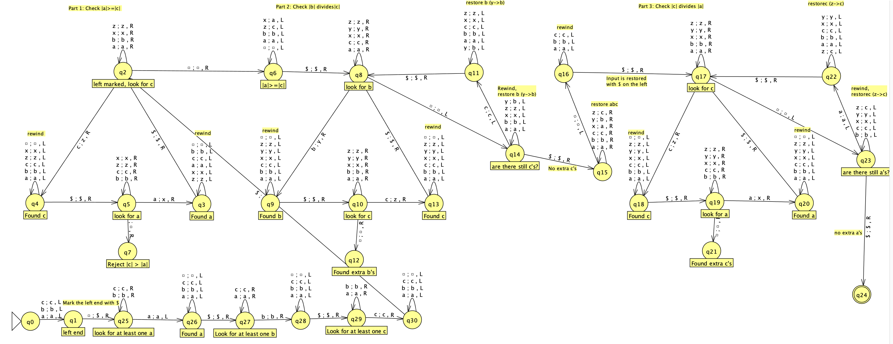

# Turing Machine for Special Language Acceptance

## Overview

This project implements a deterministic one-way infinite single-tape Turing Machine using JFLAP that accepts the language:

{ w | w ∈ {a, b, c}* such that:

- the number of a's in w ≥ the number of c's in w
- the number of b's in w divides the number of c's in w
- the number of c's in w divides the number of a's in w
}

## Project Structure

- `JFLAP7.1.jar`: The JFLAP application used to create and simulate the Turing machine
- `eskenazi_p6.jff`: The JFLAP file containing the Turing machine implementation
- `eskenazi_p6_tests.txt`: Test cases for validating the Turing machine

## Implementation Details

The Turing machine implementation follows these key steps:

1. Mark the left end of the input with a special symbol ($)
2. Check if the number of a's is greater than or equal to the number of c's
   - This is done by marking one 'a' with 'x' and one 'c' with 'z' in each pass
   - If we run out of c's first or at the same time as a's, condition is satisfied
   - If we run out of a's first, reject
3. Check if the number of b's divides the number of c's
   - This is done by repeatedly marking one 'b' with 'y' and counting off that many 'c's with 'z'
   - If all c's are marked exactly when all b's are marked, condition is satisfied
   - If we have extra c's or run out of c's before marking all b's, reject
4. Check if the number of c's divides the number of a's
   - This is done by repeatedly marking one 'c' with 'z' and counting off that many 'a's with 'x'
   - If all a's are marked exactly when all c's are marked, condition is satisfied
   - If we have extra a's or run out of a's before marking all c's, reject
5. Accept if all conditions are satisfied, reject otherwise

The machine uses different states to track progress and restore symbols when needed for multiple passes.

## How to Run

1. Install JFLAP 7.1 or use the included JAR file
2. Open the `cs373-proj5v05.jff` file with JFLAP
3. Use the "Input" option to test strings from the test file
4. Run the simulation to see if the machine accepts or rejects the input

## Test Cases

The test file includes multiple strings to test acceptance and rejection scenarios:

- Accepted strings include: "abc", "aabbcc", "abcabc", etc.
- Rejected strings include: empty string, "a", "ab", "abcc", etc.

## Notes

This implementation is optimized for clarity and correctness rather than minimizing the number of states.

## Diagram

The above diagram shows the state transitions of the Turing machine implementation.